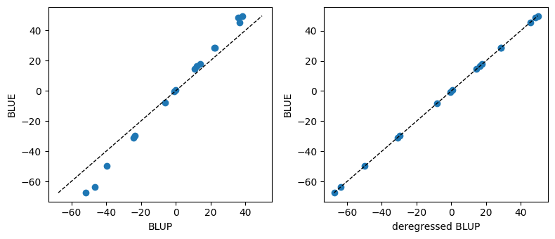

Deciding whether a given effect should enter the model as fixed or random is rarely
obvious: in most cases, the same explanatory variable can legitimately be treated either way.
The goal of this section is not to give a mechanical rule but to lay out the arguments
that should inform that decision when specifying a model with [pyreml]{.pyreml}.

The core idea behind a random effect is that its levels are regarded as a sample drawn
from a population, summarised by a distribution:

$$
\mathbf{a} \sim \mathcal{N}(0, \mathbf{\Sigma_a}),
$$

which is often made acceptable by the central limit theorem.

A fixed effect, by contrast, carries no such
distributional assumption: its levels are treated as purely deterministic quantities to
be estimated on their own, with no population behind them.

## The BLUP intuition

When hesitating between treating an effect as BLUE or BLUP, it helps to understand the
mathematics that separates Best Linear Unbiased Estimation (BLUE) from Best Linear
Unbiased Prediction (BLUP).

- BLUEs are fitted so as to capture as much of the variance in the training data as
  possible.

- BLUPs are shrunk towards $0$ in proportion to their uncertainty.
This shrinkage aims at enhancing their generalizability,
namely maximizing the correlation
between the predicted and the true value underlying the observed phenomenon.

This shrinkage can be expressed analytically [@garrick_deregressing_2009]:

$$
\mathbf{\tilde{a}} = \mathbf{\hat{a}}\, \mathbf{\Delta_a}^{-1},
\qquad
\mathbf{\Delta_a} = (\mathbf{G_a} - \mathbf{P_a})\, \mathbf{G_a}^{-1},
$$

with:

- $\mathbf{\tilde{a}}$ the deregressed BLUPs, which can be understood as the value $\mathbf{\hat{a}}$ would have
taken if they were BLUEs,
- $\mathbf{\hat{a}}$ the BLUPs of the random effect $\mathbf{a}$,
- $\mathbf{\Delta_a}$ the coefficient of determination matrix of $\mathbf{\hat{a}}$,
- $\mathbf{P_a}$ the prediction error variance matrix of $\mathbf{\hat{a}}$.

The diagonal of $\mathbf{\Delta_a}$ can immediately
be understood as $R^2$, ranging from $0$ to $1$:

- close to $0$, it indicates that no information is available for this specific level
of the random effect. In this case, the corresponding BLUP is extremely shrunk:
$\mathbf{\hat{a}}_i \approx 0$.

- close to $1$, the level of the random effect is well known. In this case, defining
the effect as BLUE or BLUP would lead to the same outcome: 
$\mathbf{\hat{a}}_i \approx \mathbf{\tilde{a}}_i$,

The example below makes the concept tangible, isolating
the exact mathematical difference between BLUEs and BLUPs.

::: {.scroll-cell}
```python
import numpy as np
import matplotlib.pyplot as plt
from pyreml import (
    MixedModel,
    Random,
    larix as df
)

# prepare the data and fit the models
df = df[df["year"] == 2000].copy()

mod_BLUE = MixedModel.from_dataframe(
    data     = df,
    response = "height",
    fixed    = "1 + C(BLOC, Sum)",
).fit()

mod_BLUP = MixedModel.from_dataframe(
    data     = df,
    response = "height",
    random = Random(
        unit = "BLOC"
    )
).fit()

# format the BLUPs
blup_tab = mod_BLUP.random[0].table.set_index("unit")["prediction"]
levels = blup_tab.index.tolist()
BLUP   = blup_tab.to_numpy()

# format the BLUEs
blue = mod_BLUE.estimates.set_index("term")["estimate"]
sum_terms  = blue[blue.index.str.startswith("C(BLOC, Sum)")]
sum_levels = sum_terms.index.str.extract(r"\[S\.(.+)\]")[0].tolist()
dev = dict(zip(sum_levels, sum_terms.to_numpy()))
(absorbed,) = [lvl for lvl in levels if lvl not in dev]
dev[absorbed] = -sum(dev.values())
dev_BLUE = np.array([dev[lvl] for lvl in levels])
BLUE = dev_BLUE

# compute CD
sigma2 = mod_BLUP.random[0].variance["sigma"]
Sigma  = np.eye(len(levels)) * sigma2
PEV    = mod_BLUP.random[0].PEV.numpy()
CD     = (Sigma - PEV) @ np.linalg.inv(Sigma)

# compute the deregressed BLUP
DEREG = BLUP @ np.linalg.pinv(CD)

fig, axes = plt.subplots(1, 2, figsize=(8, 3.5))
for ax, x, title in [(axes[0], BLUP,  "BLUP"),
                     (axes[1], DEREG - np.mean(DEREG), "deregressed BLUP")]:
    ax.scatter(x, BLUE)
    lims = [min(x.min(), BLUE.min()), max(x.max(), BLUE.max())]
    ax.plot(lims, lims, "k--", lw=1)
    ax.set_xlabel(title)
    ax.set_ylabel("BLUE")
plt.tight_layout(); plt.show()
```
:::

{fig-align="center"}

- The left panel shows the raw BLUPs against the matching BLUEs:

    - the amplitude of BLUPs is always lower than the amplitude of BLUEs, 
preventing them from capturing as much variance in the training set.

    - the rdistance from the BLUPs to the BLUEs is idiosyncratic, and dependent
of the individual level of reliability around each BLUP.

- The right panel shows the deregressed BLUPs against the same BLUEs: once the
shrinkage is removed, the points fall back onto an exact identity line. 
The whole difference between a BLUP and a BLUE is this reliability-driven shrinkage.

## Arguments in favor of a fixed effect

### Can the effect be seen as drawn from a population of effects?

This is the first question to ask, because if the levels at
hand are not exchangeable members of some
larger population, the distributional assumption $\mathbf{a} \sim \mathcal{N}(0,
\mathbf{\Sigma_a})$ is simply not meaningful. When there is no population to speak of,
there is no real choice: the effect has to be fixed.

### Are there enough levels to estimate a variance?

A variance is a population quantity, and estimating one from a
handful of levels is hopeless. Two or three individuals of the
same species is far from optimal when it comes to characterize
the distribution they would be drawn from, whereas a hundred do.
With scarce samples, the variance estimate is so unstable that a
fixed treatment, estimating each level directly,
is safer than trying to learn a distribution.

### Do we want to absorb confounding coming from the design?

Effects that exist only to control for the structure
of the experiment, such as a block, a batch, or any other
nuisance factor, are best removed as completely as possible. Treating them as
fixed soaks up their contribution entirely (maximizing their partial $R^2$,
as discussed in the [previous section](fixed_random.qmd#the-blup-intuition)) 
rather than shrinking it, which protects the
effects of focal interest from design-induced confounding ones.

## Arguments in favor of a random effect

### Are the degrees of freedom available to estimate one effect per level ?

When the number of levels is large relative
to the data, as with an effect specified at the individual
level, estimating every level as a free fixed parameter exhausts the degrees of freedom
and yields noisy, overfit estimates. A random effect regularises the problem: by tying
the levels to a common distribution it spends a single variance parameter instead of one
estimate per level, and the shrinkage keeps the estimates stable.

This is often more a pragmatic argument than a conceptual one, constraining the
choice toward picking *e.g.* design effects as random for the sake of parcimony, 
even though they would be theoretically optimally selected as
random as to get rid of the most of indesirable, confounded variance.

### Is there a known variance structure ?

If the effect comes with a known covariance
structure, then it is by construction an effect
with a variance, and it is naturally random.
A deterministic fixed effect has no variance of its own.

The Estimation Error Variance (EEV)
attached to a BLUE is an artefact of the
sampling process, not a variance expressed by the effect itself.

### Do we aim generalization outside the training dataset ?

As mentionned in the [previous section](fixed_random.qmd#the-blup-intuition),
the BLUPs are mathematically build as to maximize the generalizability of
a prediction. As opposed to a commun misconception, the focal interest for 
an effect and its generalizability argues in favor of considering it as random.

## Ambivalent effects

When the arguments above do not point clearly in one direction, the decision can be
weighted by comparing the two candidate models on the AIC which balances
the fit quality against the number of parameters each formulation spends.

```python
print(mod_BLUE.AIC)
print(mod_BLUP.AIC)
```