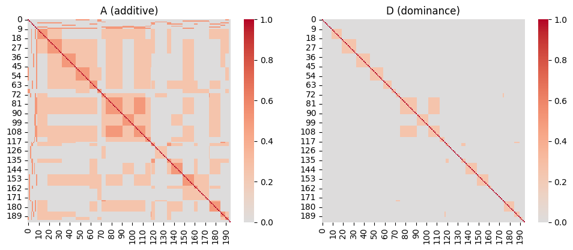
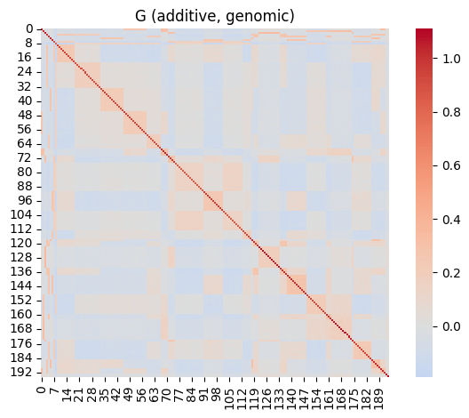

Quantitative genetics is the craddle of mixed modeling, and [pyreml]{.pyreml} tributes
it with a handful of helpers dedicated to build genetic relatedness matrices. This matrices
serve as `right_hand="str"` known covariances, structuring the genetic random effects of
biological units.

```python
Random(
    unit         = "ID",
    right_hand   = "str",
    covariance   = K,
    matrix_index = ped["id"].tolist(),
)
```

These helpers are direct transpositions of established R tools.

## Additive relationship

A pedigree helper `prepare_pedigree` is available. It expects a
[pandas](https://pandas.pydata.org/) DataFrame with
columns `id`, `dam` and `sire` (parents may be missing). The preparation includes:

- lowering and checking the column names,

- coercing the various missing markers to properly handled `NaN`,

- dropping duplicate individuals,

- adding founder rows for any parent referenced but not itself listed.


```python
import numpy as np
import matplotlib.pyplot as plt
import seaborn as sns
from scipy.stats import norm

from pyreml import (
    prepare_pedigree,
    A_pedigree,
    D_pedigree,
    larix as df,
    A_genomic,
)

ped = prepare_pedigree(df[["ID", "SIRE", "DAM"]])
```

Then, `A_pedigree` transposes **makeA** from the R package
[nadiv](https://cran.r-project.org/package=nadiv).

```python
A = A_pedigree(ped)
```

## Dominance relationship

`D_pedigree` transposes **makeD** from [nadiv](https://cran.r-project.org/package=nadiv).
It derives the dominance relationship matrix $\mathbf{D}$ from $\mathbf{A}$: for
two individuals $k \neq j$ with dams $d$ and sires $s$ [@shaw_genetic_1998; @wolak_dominance_2014]:

$$
D_{kj} = \tfrac{1}{4}\left(
A_{d_k d_j} A_{s_k s_j} + A_{d_k s_j} A_{s_k d_j}
\right),
\qquad
D_{kk} = 2 - A_{kk}.
$$

Caution:

- this construction is an approximation that is only exact in the
absence of inbreeding. Under inbreeding, it becomes unreliable [@ovaskainen_bayesian_2008].

- whenever a single parent is missing, the individual is treated as a founder.

```python
D = D_pedigree(ped)

fig, axes = plt.subplots(1, 2, figsize=(10, 4))
sns.heatmap(A, cmap="coolwarm", center=0, ax=axes[0], square=True)
axes[0].set_title("A (additive)")
sns.heatmap(D, cmap="coolwarm", center=0, ax=axes[1], square=True)
axes[1].set_title("D (dominance)")
plt.tight_layout()
plt.show()
```

{fig-align="center"}

## Genomic relationship

The genomic relationship matrix `A_genomic` transposes the **A.mat** function of the R package
[rrBLUP](https://cran.r-project.org/package=rrBLUP). It builds a genomic
relationship matrix from a [numpy](https://numpy.org/) marker matrix `X` of a
diploid species, coded $-1, 0, 1$; with individuals in rows, markers in columns.

Relatedness is computed using VanRaden [-@vanraden_efficient_2008] approach. Setting `shrink=True` applies
the Endelman–Jannink [-@endelman_shrinkage_2012] shrinkage for conditionning the matrix.

As an illustration, let's realize the naive simulation of an SNP genotype matrix
from the pedigree relatedness.

::: {.scroll-cell}
```python
rng = np.random.default_rng(42) 
n = A.shape[0]
m = 10_000
maf = rng.uniform(0.05, 0.95, size=m)
thr = norm.ppf(1 - maf)
L = np.linalg.cholesky(A)
X = np.zeros((n, m))
for l in range(m):
    g1 = (L @ rng.standard_normal(n)) > thr[l]
    g2 = (L @ rng.standard_normal(n)) > thr[l]
    X[:, l] = (g1.astype(float) - 0.5) + (g2.astype(float) - 0.5)  #

# compute the genomic kinship
G = A_genomic(
    X,
    min_MAF     = 0.05,
    max_missing = 0.1,
    shrink      = True
)

sns.heatmap(G, cmap="coolwarm", center=0, square=True)
plt.title("G (additive, genomic)")
plt.tight_layout()
plt.show()
```
:::

{fig-align="center"}
