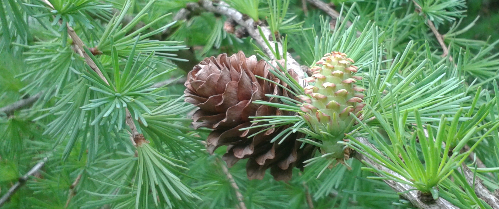

[pyreml]{.pyreml} provides an illustrative dataset `larix` which allows for a wide variety
of mixed model applications.

It consists in a genetic trial of different *Larix* species,
filtered over the sole *Larix decidua* (Mill.) taxon.
The original trial encompasses 3 exploitable sites, each
divided into randomized blocs. Only the first few blocs of the site
of Saint-Saud Lacoussière (France) is provided. The site was planted
in 1997 by INRA *Larix* breeder and geneticist Luc Pâques. The whole
dataset and a more extensive context were published with [@marchal_hybrid_2017].

The trees are genetically bound with each other through a known pedigree (see [Kinships](kinships.qmd)). Several traits are
available for multivariate analysis (see [Multivariate](multivariate.qmd)). The traits were observed for consecutive campaign,
so all these data are longitudinal (see [Random regression](random_regression.qmd)).

  
  

    © Marchal A.
  

