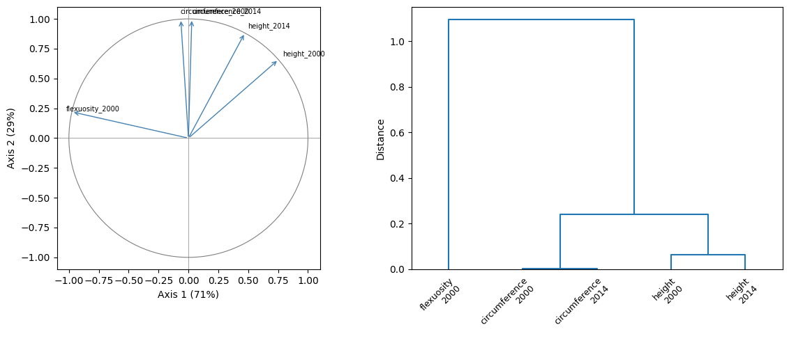

[pyreml]{.pyreml} takes one or several columns as `response` and performs
multivariate analysis by modeling the covariance between them
[*e.g.* @calus_accuracy_2011; @jia_multiple-trait_2012]

## Formulation

For two responses $1$ and $2$ and two random effects $\mathbf{a}$ and $\mathbf{b}$, the model
stacks response-wise:

$$
\begin{bmatrix}\mathbf{y}_1\\\mathbf{y}_2\end{bmatrix}
=
\begin{bmatrix}\mathbf{X}_1 & \mathbf{0}\\\mathbf{0} & \mathbf{X}_2\end{bmatrix}
\begin{bmatrix}\boldsymbol{\beta}_1\\\boldsymbol{\beta}_2\end{bmatrix}
+
\begin{bmatrix}
\mathbf{Z}_{a1} & \mathbf{0} & \mathbf{Z}_{b1} & \mathbf{0}\\
\mathbf{0} & \mathbf{Z}_{a2} & \mathbf{0} & \mathbf{Z}_{b2}
\end{bmatrix}
\begin{bmatrix}
\mathbf{u}_{a1}\\\mathbf{u}_{a2}\\\mathbf{u}_{b1}\\\mathbf{u}_{b2}
\end{bmatrix}
+
\begin{bmatrix}\mathbf{r}_1\\\mathbf{r}_2\end{bmatrix}.
$$

The random effects are jointly distributed across responses, for effect
$\mathbf{a}$:

$$
\begin{bmatrix}\mathbf{u}_{a1}\\\mathbf{u}_{a2}\end{bmatrix}
\sim
\mathcal{N}\!\left(\mathbf{0}, \mathbf{\Sigma_a} \otimes \mathbf{K_a}\right),
$$

the between-response covariance being carried by the left-hand factor
$\mathbf{\Sigma_a}$.

The full stacked random vector keeps the direct-sum form 
$\mathbf{u} \sim \mathcal{N}(\mathbf{0}, \bigoplus_e \mathbf{\Sigma}_e \otimes
\mathbf{K}_e)$, and the residual stacks likewise (see [Training](training.qmd#reml)).
This extends to any number of responses, random effects and
random-regression components.

The fixed effects $\boldsymbol{\beta}$ are always taken as response-specific.

## Residual structure

Two common situations call for different residual left-hand factors.

### Multiple traits, same environment

A residual correlation between traits is identifiable and
advisable (`left_hand="full"`):

$$
\mathbf{R} =
\begin{bmatrix}\sigma^2_{R1} & \sigma_{R12}\\\sigma_{R12} & \sigma^2_{R2}\end{bmatrix}
\otimes \mathbf{I}.
$$

```python
model = MixedModel.from_dataframe(
    data     = df,
    response = ["yield", "moisture"],
    fixed    = "1 + block",
    random   = Random(
        unit       = "genotype",
        right_hand = "str",
        covariance = K,
        left_hand  = "full",
    ),
    residual = Residual(
        left_hand  = "full"
    ),
)
```

### Multiple environments, same trait

A residual correlation is not separable from the data, so the residual
left-hand factor should stay diagonal (`left_hand="diag"`):

$$
\mathbf{R} =
\begin{bmatrix}\sigma^2_{R1} & \mathbf{0}\\\mathbf{0} & \sigma^2_{R2}\end{bmatrix}
\otimes \mathbf{I}.
$$

```python
model = MixedModel.from_dataframe(
    data     = df,
    response = ["yield_north", "yield_south"],
    fixed    = "1 + block",
    random   = Random(
        unit       = "genotype",
        right_hand = "str",
        covariance = K,
        left_hand  = "full",
    ),
    residual = Residual(
        left_hand  = "diag"
    ),
)
```

## Factor-analytic

When the number of responses grows, estimating a `full` $\mathbf{\Sigma_A}$
becomes expensive. The [factor-analytic](variance_structures.qmd#factor-analytic) structure approximates
it with a few axes, set by `n_axes`:

```python
random = Random(
    unit       = "genotype",
    right_hand = "str",
    covariance = K,
    left_hand  = "fa",
    n_axes     = 2
)
```

The same practical considerations apply as for the `full` multivariate
covariance structure: the residual structure should be kept consistent with
the random effects, depending on the experimental design.

When paired with a diagonal residual variance structure,
FA variance matrices can be inverted using [SMW](training.qmd#smw)
taking maximal benefit from the factorization in the fitting process.

## Illustration

Let's realize the multivariate analysis of the `larix` illustrative dataset using FA.
In this example, the responses are a combination of traits and years.

::: {.scroll-cell}
```python
import numpy as np
from numpy.linalg import inv
from scipy.linalg import sqrtm
from scipy.cluster.hierarchy import linkage, dendrogram
from scipy.spatial.distance import squareform
import matplotlib.pyplot as plt
from pyreml import (
    MixedModel,
    Random,
    Residual,
    A_pedigree,
    prepare_pedigree,
    larix as df
)

traits = [
    "height",
    "circumference",
    "flexuosity"
]

# prepare data
df = df[df["year"].isin([2000, 2014])]

long = df.melt(
    id_vars=["ID", "DAM", "SIRE", "BLOC", "year"],
    value_vars=traits,
    var_name="trait",
    value_name="value"
)
long["resp"] = long["trait"] + "_" + long["year"].astype(str)
wide = (
    long.pivot_table(
    index=["ID", "DAM", "SIRE", "BLOC"],
    columns="resp", values="value"
    ).dropna(
        axis=1,
        how="all"
    ).reset_index()
)
responses = [
    c for c in wide.columns if c not in (
        "ID",
        "DAM",
        "SIRE",
        "BLOC"
    )
]

# compute kinship
ped = prepare_pedigree(
    wide[[
        "ID",
        "DAM",
        "SIRE"
    ]]
)
A   = A_pedigree(ped)

# initiatlisation
P = wide[responses].cov().to_numpy()

# run the FA model
model = MixedModel.from_dataframe(
    data     = wide,
    response = responses,
    fixed    = "1",
    random   = Random(
        unit         = "ID",
        left_hand    = "fa",
        n_axes       = 2,
        right_hand   = "str",
        covariance   = A,
        matrix_index = ped["id"].tolist(),
        init         = P/2,
        jitter       = 1e-6,
    ),
    residual = Residual(
        left_hand    = "fa",
        n_axes       = 2,
        right_hand   = "iid",
        init         = P/2,
        jitter       = 1e-6,
    ),
).fit()
```
:::

A [jitter](variance_structures.qmd#jitter)
is required as some specificities of the random effect
$\operatorname{diag}(\mathbf{\Psi_a})$ are close to zero in this example.

The factor-analytic can be read as a principal component analysis. Let us
scale the covariance to correlation, interpret $\mathbf{\Lambda_a}$ as a raw
amount of $\mathbf{\Sigma_a}$ explained by each axis, and study the structure of
the genetic component of the traits in their correlative space.

::: {.scroll-cell}
```python
# FA decomposition of the genetic covariance
S  = model.random[0].variance["sigma"]
fa = model.random[0].variance["metadata"]["fa"]
Q, Lam, Psi = fa["Q"], fa["Lambda"], fa["Psi"]
Gamma = Q * np.sqrt(Lam)

# correlation + average-linkage clustering
Dn   = inv(sqrtm(np.diag(np.diag(S))))
cor  = Dn @ S @ Dn
dist = 1 - cor
np.fill_diagonal(dist, 0)
Z = linkage(squareform(np.round(dist, 10)), method="average")

# correlation circle
PC   = Dn @ Gamma
expl = Lam / np.trace(S)

# two aligned panels
fig, (ax1, ax2) = plt.subplots(1, 2, figsize=(12, 5))

ax1.add_patch(plt.Circle((0, 0), 1, fill=False, color="grey", lw=0.8))
ax1.axhline(0, color="grey", lw=0.5); ax1.axvline(0, color="grey", lw=0.5)
for i, name in enumerate(responses):
    ax1.annotate("", xy=(PC[i, 0], PC[i, 1]), xytext=(0, 0),
                 arrowprops=dict(arrowstyle="->", color="steelblue"))
    ax1.text(PC[i, 0] * 1.05, PC[i, 1] * 1.05, name, fontsize=7)
ax1.set_xlim(-1.1, 1.1); ax1.set_ylim(-1.1, 1.1); ax1.set_aspect("equal")
ax1.set_xlabel(f"Axis 1 ({100 * expl[0]:.0f}%)")
ax1.set_ylabel(f"Axis 2 ({100 * expl[1]:.0f}%)")

labels = [r.replace("_", "\n") for r in responses]
dendrogram(Z, labels=labels, ax=ax2, color_threshold=0)
ax2.set_ylabel("Distance")
ax2.tick_params(axis="x", labelsize= 9)
plt.setp(ax2.get_xticklabels(), rotation=45, ha="right", rotation_mode="anchor")

fig.tight_layout()
plt.show()
```
:::

This yields a correlation circle allowing direct interpretation of the factorial axes,
and a dendrogram clustering the responses with regards to the random effect.

{fig-align="center"}