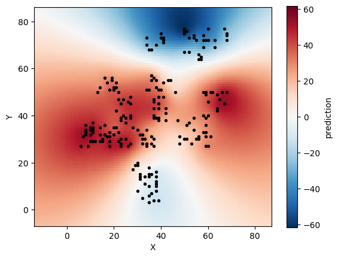

After fitting, [pyreml]{.pyreml} can predict random effects at levels of `unit`
that were not observed in the training data, for instance spatial interpolation
or genomic prediction. This is available for effects whose right-hand factor
relates the levels to one another:

| `right_hand` | Prediction input                                              |
|--------------|--------------------------------------------------------------|
| `str`        | A known covariance over training and prediction levels.      |
| `ar`         | A known distance over training and prediction levels.        |

## Prediction on-the-fly

The random effects can be directly obtained from
[Henderson's equations](training.qmd#hmme) with the new levels included as
*dummy* individuals: carrying no observation, they are tied to the observed
levels solely through their correlation to the observed ones expressed in $\mathbf{K_a}$.

## Prediction error variance

All the random effects $\hat{\mathbf{u}}$ included in the HMME
come with a Prediction Error Variance (PEV). The PEV and their
covariance $\mathbf{P}$ are computed all together as:

$$
\mathbf{P} =
\mathbf{G}
- \mathbf{G}\mathbf{Z}^\top\mathbf{V}^{-1}\mathbf{Z}\mathbf{G}
+ \mathbf{G}\mathbf{Z}^\top\mathbf{V}^{-1}\mathbf{X}
  (\mathbf{X}^\top\mathbf{V}^{-1}\mathbf{X})^{-1}
  \mathbf{X}^\top\mathbf{V}^{-1}\mathbf{Z}\mathbf{G}.
$$

The PEV matrix for each random effect $\mathbf{P_a}$ is then exposed as `model.random[i].PEV`.

## Kriging

Solving the HMME requires the inversion of $\mathbf{G}$, hence implicitely
$\mathbf{K_a}$, which can bottleneck when the number of levels to
predict upscales.

For this reason, [pyreml]{.pyreml} provides a kriging approach that consists
in the sole inversion of the $\mathbf{K}_{\text{train}}$, the submatrix of $\mathbf{K_a}$
that only encompasses the levels included in the training set (*i.e.* the
observed levels):

$$
\hat{\mathbf{a}}_{\text{pred}} =
\mathbf{K}_{\text{pred}}\,\mathbf{K}_{\text{train}}^{-1}\,
\hat{\mathbf{a}}_{\text{train}},
$$

with $\hat{\mathbf{a}}_{\text{pred}}$ the pure prediction of unobserved levels, 
$\hat{\mathbf{a}}_{\text{train}}$ the prediction of the observed levels (usually
predicted at the HMME step), and $\mathbf{K}_{\text{pred}}$ the covariance
between the observed and non-observed levels.

For `str`, $\mathbf{K_a}$ is read from the supplied covariance; for `ar`, it is
rebuilt from the supplied distance with the estimated decay,
$(\mathbf{K_a})_{ij} = \exp(-\hat{\rho}\, E_{ij})$.

Prediction by kriging is operated at the random effect level, using `predict`:

```python
preds = model.random[0].predict(
    matrix_index = full_index,   # all levels: train + pred
    covariance   = K_full,       # or: distance = D_full for "ar"
)
```

`matrix_index` orders a complete covariance (or distance) over all levels,
training and new; `predict` returns a long-format DataFrame with one row per
(unit, response, component).

## Illustration

Let's realize the spatial analysis of the `larix` illustrative dataset using the
kriging prediction module.

::: {.scroll-cell}
```py
import numpy as np
import matplotlib.pyplot as plt
from pyreml import MixedModel, Random, larix as df

## prepare data
df = df[df["year"] == 2000].copy()
df["ID"] = np.arange(len(df))

## prepare distance matrix
coords  = df[["X", "Y"]].to_numpy()
D_train = np.linalg.norm(
    coords[:, None, :] - coords[None, :, :],
    axis=-1
)

# fit the model
mod = MixedModel.from_dataframe(
    data     = df,
    response = "height",
    fixed    = "1",
    random   = Random(
        unit         = "ID",
        right_hand   = "ar",
        distance     = D_train,
        matrix_index = df["ID"].tolist(),
    ),
).fit()

# prepare kriging distance matrix
gx = np.arange(coords[:, 0].min()-20, coords[:, 0].max()+20)
gy = np.arange(coords[:, 1].min()-10, coords[:, 1].max()+10)
GX, GY   = np.meshgrid(gx, gy)
grid     = np.column_stack([GX.ravel(), GY.ravel()])
grid_ids = np.arange(len(df), len(df) + len(grid))
all_coords = np.vstack([coords, grid])
D_full = np.linalg.norm(all_coords[:, None, :] - all_coords[None, :, :], axis=-1)

# predict by kriging
pred = mod.random[0].predict(
    matrix_index = df["ID"].tolist() + grid_ids.tolist(),
    distance     = D_full,
)

# plot the results
surface = pred["prediction"].to_numpy().reshape(GX.shape)
m = np.abs(surface).max()

plt.imshow(surface, origin="lower",
           extent=[gx.min(), gx.max(), gy.min(), gy.max()],
           aspect="equal", cmap="RdBu_r", vmin=-m, vmax=m)                   
plt.colorbar(label="prediction")
plt.scatter(df["X"], df["Y"], c="black", s=8)
plt.xlabel("X"); plt.ylabel("Y")
plt.show()                 
```
:::

This models the spatial effect throughout the whole experimental design:

{fig-align="center"}
