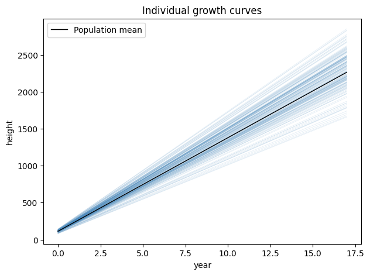

Each random effect of a [pyreml]{.pyreml} model takes a `formula` specification,
that is reminescent of the `(1 + x | unit)` idiom in [lme4](https://cran.r-project.org/web/packages/lme4/index.html).
This formula should be comprehensive for [patsy](https://pypi.org/project/patsy/).
Each column read from this formula (intercept, regressor, modalities of factors, and
interactions) becomes a component of the effect that varies from one `unit`
to the next.

The left-hand factor $\mathbf{\Sigma_a}$ models the covariance
between these components (see [variance structures](variance_structures.qmd)).

## Random regression

A formula including a regression, such as `"1 + x"`,
 gives each unit its own random intercept and its
own random slope.

```python
Random(
    unit       = "patient",
    formula    = "1 + x",
    left_hand  = "full",
    right_hand = "iid",
)
```

Developing this example:

$$
y_{ij} = (\beta_0 + a_{0i}) + (\beta_{1} + a_{1i})\, x_{j} + r_{ij},
\qquad
\begin{bmatrix} \mathbf{a_{0}} \\ \mathbf{a_{1}} \end{bmatrix}
\sim \mathcal{N}(\mathbf{0}, \mathbf{\Sigma_a} \otimes \mathbf{I}),
$$

Where $j$ is the index for the longitudinal variable (for instance, the time or a dose of treatment) and
$i$ is the index for the random effect unit (for instance, an individual).

## Random factors

A formula can also carry a factor, or the interaction between factors, 
so that the effect of each of its modalities is random across units.
For instance:

```python
Random(
    unit       = "patient",
    formula    = "0 + C(treatment)",
    left_hand  = "full",
    right_hand = "iid",
)
```

Each treatment now contributes one random component per patient, and the left-hand
factor $\mathbf{\Sigma_a}$ (across modalities of treatments) captures how
those treatment effects covary.

## Illustration

Let's realize a random regression on the `larix` illustrative dataset,
modeling individual tree growth along years.

::: {.scroll-cell}
```py
import numpy as np
import matplotlib.pyplot as plt
from pyreml import (
    MixedModel,
    Random,
    Residual,
    A_pedigree,
    prepare_pedigree,
    larix as df
)

# scale years
df["year"] = df["year"] - df["year"].min()

# compute kinship
ped = prepare_pedigree(df[[
    "ID",
    "DAM",
    "SIRE"
]])
K = A_pedigree(ped)

# fit the model
mod = MixedModel.from_dataframe(
    data     = df,
    response = "height",
    fixed    = "1 + year",
    random   = Random(
        unit         = "ID",
        formula      = "1 + year",
        left_hand    = "full",
        right_hand   = "str",
        covariance   = K,
        matrix_index = ped["id"].tolist(),
        jitter       = 1e-6,
    ),
    residual = Residual(
        left_hand = "iid",
        right_hand = "het",
        het_formula = "C(year)"
    )
).fit()

# fixed effects
b = mod.estimates.set_index("term")["estimate"]
b0, b1 = b["Intercept"], b["year"]

# individual effects
re = mod.random[0].table.pivot_table(
    index   = "unit",
    columns = "component",
    values  = "prediction"
)

yr  = np.linspace(df["year"].min(), df["year"].max(), 100)

fig, ax = plt.subplots(figsize=(7, 5))

# individual curves
for _, row in re.iterrows():
    a0, a1 = row["Intercept"], row["year"]
    ax.plot(
        yr,
        (b0 + a0) + (b1 + a1) * yr,
        color = "#4B8BBE",
        lw    = 0.6,
        alpha = 0.15
    )

# population curve
ax.plot(
    yr,
    b0 + b1 * yr,
    color = "black",
    lw    = 1,
    label = "Population mean"
)
plt.title("Individual growth curves")
ax.set_xlabel("year"); ax.set_ylabel("height")
ax.legend()
plt.show()
```
:::

Each individual ends up with specific random parameters for a regression.
Note that the residual variance was choose as year-specific, year being treated
as a factor (`C(year)`) in the heteroscedasticity specification. Also, a [jitter](variance_structures.qmd#jitter)
is required as the correlation between the slope and intercept in this case is
almost perfectly $1$.

{fig-align="center"}