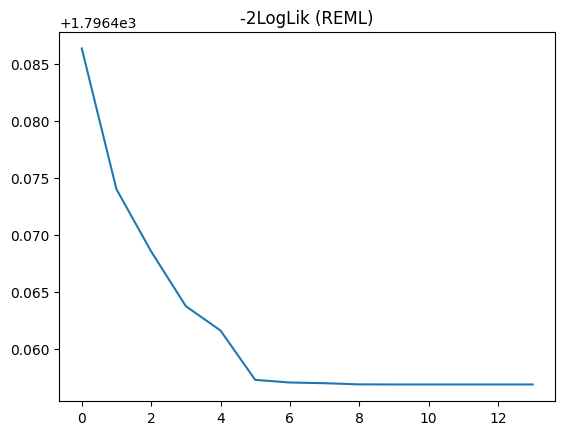

[pyreml]{.pyreml} fits linear mixed models by direct differentiation of the Restricted
Maximum Likelihood (REML) using [PyTorch](https://pytorch.org/) for variance parameter estimation.
It benefits from PyTorch parallelization and GPU acceleration.

## The `fit` method

Once a [pyreml]{.pyreml} model is specified, it can be trained with the `.fit()` method.

```python
model.fit()
```

This runs the full pipeline, calling this series of methods: 

- `.OLS()`, [Ordinary least square](#ols) (OLS) initialization of $\boldsymbol{\beta}$,

- `.REML()`, [REML](#reml) estimation of the variance components,

- `.HMME()`, [Henderson's mixed model equations](#hmme) (HMME) for the random-effect predictions.

REML and HMME are engaged whenever the model carries random effects, a residual variance structure,
or several responses ; otherwise the fitting process stops at the OLS step.

## OLS

The fixed effects are first estimated by ordinary least squares,

$$
\hat{\boldsymbol{\beta}}_{\text{OLS}} =
(\mathbf{X}^\top\mathbf{X})^{-1}\mathbf{X}^\top\mathbf{y}.
$$

If the model carries no random effect, an `iid` residual and a single response,
then the OLS solution is already the answer and training stops here.

Otherwise the OLS estimate initializes $\boldsymbol{\beta}$ before REML.
This initialization is always performed by `.fit()` and is strongly recommended
for lower level uses of [pyreml]{.pyreml}.

## REML

The per-effect blocks $\mathbf{G_e} = \mathbf{\Sigma_e} \otimes \mathbf{K_e}$
(see [Variance structures](variance_structures.qmd)) are assembled into the full
random-effect covariance by a direct sum over effects:

$$
\mathbf{G} = \bigoplus_\mathbf{e} \mathbf{G_e},
$$

and the marginal covariance of the observations follows as:

$$
\mathbf{V} = \mathbf{Z}\mathbf{G}\mathbf{Z}^\top + \mathbf{R},
$$

with residual variance
$\mathbf{R} = \mathbf{W}\left(\mathbf{\Sigma_R} \otimes \mathbf{K_R}\right)\mathbf{W}^\top$.

Training estimates the variance parameters carried by the $\mathbf{\Sigma_e}$,
$\mathbf{K_e}$, $\mathbf{\Sigma_R}$ and $\mathbf{K_R}$ jointly with $\boldsymbol{\beta}$, then obtains
the random effects $\mathbf{u}$.

The variance parameters and $\boldsymbol{\beta}$ are estimated by minimizing the
restricted negative log-likelihood [@patterson_recovery_1971; @harville_maximum_1977]:

$$
-2\ell_{\text{REML}} = \log\lvert\mathbf{V}\rvert
+ \log\lvert\mathbf{X}^\top\mathbf{V}^{-1}\mathbf{X}\rvert
+ (\mathbf{y}-\mathbf{X}\boldsymbol{\beta})^\top\mathbf{V}^{-1}
  (\mathbf{y}-\mathbf{X}\boldsymbol{\beta}).
$$

The objective is differentiated by automatic differentiation and optimized with
L-BFGS under a strong-Wolfe line search, with Adam as a fallback for steps
the line search cannot complete.
The variance parameters and $\boldsymbol{\beta}$ are optimized jointly.

## HMME

With the estimated variance components treated as known, the fixed and random
effects are obtained jointly from Henderson's mixed model equations [@henderson_best_1975]:

$$
\begin{bmatrix}
\mathbf{X}^\top\mathbf{R}^{-1}\mathbf{X} & \mathbf{X}^\top\mathbf{R}^{-1}\mathbf{Z} \\
\mathbf{Z}^\top\mathbf{R}^{-1}\mathbf{X} & \mathbf{Z}^\top\mathbf{R}^{-1}\mathbf{Z}+\mathbf{G}^{-1}
\end{bmatrix}
\begin{bmatrix} \hat{\boldsymbol{\beta}} \\ \hat{\mathbf{u}} \end{bmatrix}
=
\begin{bmatrix}
\mathbf{X}^\top\mathbf{R}^{-1}\mathbf{y} \\
\mathbf{Z}^\top\mathbf{R}^{-1}\mathbf{y}
\end{bmatrix}.
$$

Their solution gives the best linear unbiased estimator (BLUE) of
$\boldsymbol{\beta}$ and the best linear unbiased predictor (BLUP) of
$\mathbf{u}$, in a single solve. They are formed only when the model has random
effects; otherwise REML already delivers $\boldsymbol{\beta}$.

The same system also yields the error variances of the estimates. See
[Prediction](prediction.qmd) for the prediction error variance of
$\hat{\mathbf{u}}$.

## SMW

The REML computation uses the Sherman–Morrison–Woodbury identity (SMW) [@MR38136]
which can have a very strong impact on the performance of the models
depending on their specification.

### Interest of SMW for REML

The use of SMW aims at avoiding forming and inverting $\mathbf{V}$ directly:

$$
\begin{align}
\mathbf{V}^{-1}
    &= \left(\mathbf{Z}\mathbf{G}\mathbf{Z}^{\top} + \mathbf{R}\right)^{-1} \\
    &= \mathbf{R}^{-1}
    - \mathbf{R}^{-1}\mathbf{Z}
   \mathbf{C}^{-1}
    \mathbf{Z}^{\top}\mathbf{R}^{-1},
\end{align}
$$

with the capacitance matrix $\mathbf{C}$:

$$
\mathbf{C} = \mathbf{Z}^{\top}\mathbf{R}^{-1}\mathbf{Z} + \mathbf{G}^{-1}.
$$


The associated determinant lemma gives the REML log-determinant without forming
$\mathbf{V}$ either:

$$
\log |\mathbf{V}|
    = \log |\mathbf{R}|
    + \log |\mathbf{G}|
    + \log |\mathbf{C}|.
$$

Using the properties of direct sum and Kronecker product and direct sum:

$$
\mathbf{G}^{-1} = \bigoplus_e (\mathbf{\Sigma_e}^{-1} \otimes \mathbf{K_e}^{-1}),
$$

which can in some circumstances be much more cost efficient than inverting $\mathbf{V}$ .

For the residual (see [this section](variance_structures.qmd#the-residual)):

$$
\mathbf{R}^{-1} = \mathbf{W}\left(\mathbf{\Sigma_R}^{-1} \otimes \mathbf{K_R}^{-1}\right)\mathbf{W}^\top,
$$

which only stands under some conditions, including:

- if $\mathbf{W} = \mathbf{I}$;
- or if both $\mathbf{\Sigma_R}$ and $\mathbf{K_R}$ are diagonal, as 
$\mathbf{W}$ is a mere row-column selector.

### Examples of special interest

SMW meaningfulness can be exemplified in these situations:

- with `right_hand = str` for a given effect $\mathbf{a}$;
the inversion of $\mathbf{K_a}$ is done once for all and cached so that only
the left hand (possibly a mere scalar $\sigma^2_\mathbf{a}$) needs inversion at each step;
- with any diagonal covariance (`left_hand` in `{iid, diag}` or `right_hand` in
`{iid, het}`); the inversion turns an $O(n^3)$ factorization into an
$O(n)$ elementwise operation;
- with `left_hand = fa`; the inversion of $\mathbf{\Sigma_a}$ is also done with SMW
as it is approximated by the same form
$\mathbf{\Sigma_a} = \mathbf{Q_a}\mathbf{\Lambda_a}\mathbf{Q_a}^\top + \mathbf{\Psi_a}$,
breaking the problem down even further.

### Implementation of SMW

SMW is usually more efficient when $q < n$, with $q$
the number of columns of $\mathbf{Z}$
(the total dimension of $\mathbf{u}$) and $n$ the
number of stacked observations (*i.e.* $\mathbf{Z}$
is narrower than tall). Indeed, inverting the $q \times q$
matrix $\mathbf{C}$ is cheaper than inverting the $n \times n$ matrix
$\mathbf{V}$ only when $q < n$. 

[pyreml]{.pyreml} mostly conforms to this "dimensional rule",
selecting `SMW=True` when $q < n$, `SMW=False` otherwise.

However:

- using the high-level `from_dataframe` constructor, if the user
forces `SMW=True` or `False` then their decision takes precedence
over any other rule.
- using the high-level `from_dataframe` constructor, if all
of the following conditions are met then SMW is switched off
regardless of the dimensional rule:
    - Several responses are provided;
    - These responses do not share exactly the same missing values;
    - The residual covariance $\mathbf{R}$ is not designed as a diagonal matrix.

Indeed, in this situation
$\mathbf{R}^{-1} \neq \mathbf{W}\left(\mathbf{\Sigma_R}^{-1} \otimes \mathbf{K_R}^{-1}\right)\mathbf{W}^\top$
and inverting the $n \times n$ matrix $\mathbf{R}$ is just as expensive as inverting
$\mathbf{V}$ .

- with the low-level constructor:
    - if `varmeth_inv` only is provided, SMW is forced on;
    - if `varmeth` only is provided, SMW is forced off;
    - If both methods are available, the dimensional rule applies.

## Monitoring

The fit can be followed through the REML objective recorded at each iteration and
a convergence flag, both exposed on the model.

| Accessor                    | Content                                          |
|-----------------------------|--------------------------------------------------|
| `model.opti_REML.loss`      | The REML objective at each iteration.            |
| `model.opti_REML.converged` | Whether the convergence criterion was met.       |
| `model.opti_REML.duration`  | Wall-clock time of the REML fit, in seconds.     |

L-BFGS drives the optimization and Adam steps in only to recover iterations the
line search cannot complete; occasional Adam steps near a difficult region of the
objective are expected.

As an illustration, the last iterations of an example model REML convergence:

```py
import matplotlib.pyplot as plt
plt.plot(model.opti_REML.loss[-15:-1])
plt.title("-2LogLik (REML)")
plt.show()
```

{fig-align="center"}

Finally, the Akaike Information Criterion (AIC) is available at `model.AIC`.