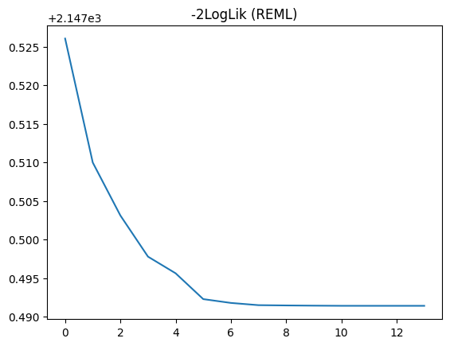

[pyreml]{.pyreml} fits linear mixed models by direct differentiation of the Restricted
Maximum Likelihood (REML) using [PyTorch](https://pytorch.org/) for variance parameter estimation.
It benefits from PyTorch parallelization and GPU acceleration.

## Fitting process

### The `fit` method

Once a [pyreml]{.pyreml} model is specified, it can be trained with the `.fit()` method.

```python
model.fit()
```

This runs the full pipeline, calling this series of methods: 

- `.OLS()`, [Ordinary least squares](#ols) (OLS) initialization of $\mathbf{\beta}$,

- `.REML()`, [REML](#reml) estimation of the variance components,

- `.HMME()`, [Henderson's mixed model equations](#hmme) (HMME) for the random-effect predictions.

REML and HMME are engaged whenever the model carries random effects, a residual variance structure,
or several responses; otherwise the fitting process stops at the OLS step.

### Numerical resolution

The `fit` method takes a `dtype` argument:

- `"mixed"` (default): OLS and a first REML pass run in `float32` to approach
the optimum cheaply, then a second REML pass and HMME run in `float64` to refine
the estimate and produce reliable outputs.

- `"double"`: all three steps (OLS, REML, HMME) run in `float64`
($=$ `torch.double`). This option is intended for GPUs optimized for `float64`
where the `float32` warm-up is not useful.

- `"float"`: all three steps run in `float32`. Fastest, but all outputs
are single-precision and in some cases the REML solver can go off-track badly.

## OLS

The fixed effects are first estimated by ordinary least squares,

$$
\hat{\mathbf{\beta}}_{\text{OLS}} =
(\mathbf{X}^\top\mathbf{X})^{-1}\mathbf{X}^\top\mathbf{y}.
$$

If the model carries no random effect, an `iid` residual and a single response,
then the OLS solution is already the answer and training stops here.

Otherwise the OLS estimate initializes $\mathbf{\beta}$ before REML.
This initialization is always performed by `.fit()` and is strongly recommended
for lower level uses of [pyreml]{.pyreml}.

## REML

### REML loss

The per-effect blocks $\mathbf{G_a} = \mathbf{\Sigma_a} \otimes \mathbf{K_a}$
(see [Variance structures](variance_structures.qmd)) are assembled into the full
random-effect covariance by a direct sum over effects:

$$
\mathbf{G} = \bigoplus_\mathbf{a} \mathbf{G_a},
$$

and the marginal covariance of the observations follows as:

$$
\mathbf{V} = \mathbf{Z}\mathbf{G}\mathbf{Z}^\top + \mathbf{R},
$$

with residual variance
$\mathbf{R} = \mathbf{W}\left(\mathbf{\Sigma_R} \otimes \mathbf{K_R}\right)\mathbf{W}^\top$.

Training estimates the variance parameters carried by the $\mathbf{\Sigma_a}$,
$\mathbf{K_a}$, $\mathbf{\Sigma_R}$ and $\mathbf{K_R}$ jointly with $\mathbf{\beta}$, then obtains
the random effects $\mathbf{u}$.

The variance parameters and $\mathbf{\beta}$ are estimated by direct gradient descent of the
negative log-likelihood [@simchoni_integrating_2023], restricted (REML) so as to yield unbiased estimates of the variance
parameters [@patterson_recovery_1971; @harville_maximum_1977]:

$$
-2\ell_{\text{REML}} = \log\lvert\mathbf{V}\rvert
+ (\mathbf{y}-\mathbf{X}\mathbf{\beta})^\top\mathbf{V}^{-1}
  (\mathbf{y}-\mathbf{X}\mathbf{\beta})
+ \log\lvert\mathbf{X}^\top\mathbf{V}^{-1}\mathbf{X}\rvert
+ (n - p) \log(2\pi).
$$

### Optimization

The objective is differentiated by automatic differentiation and optimized with
L-BFGS [@liu_limited_1989] under a strong-Wolfe line search, with Adam [@kingma_adam_2017] as a fallback for steps
the line search cannot complete.
The variance parameters and $\mathbf{\beta}$ are optimized jointly.

### Convergence criterion

Convergence is declared when two successive evaluations of $-2\ell_{\text{REML}}$
agree to within a tolerance $\tau$. The tolerance is expressed as the smallest
significant difference in likelihood with regard to the magnitude of the likelihood
and the numerical resolution:

$$
\tau = \lvert -2\ell_{\text{REML}} \rvert \cdot 10^{-\delta_\text{tot}},
\qquad
\delta_\text{tot} = \min\left(\delta_{\max},\;
  -\log_{10}(e) - \left(\delta_{c} + \delta_{r} + \delta_{\kappa}\right)
\right).
$$

The arbitrary, conservative ceiling $\delta_{\max}$ is defined to $10$ significant digits in double precision and
$5$ in single. On the other hand, $e$ is the machine epsilon of the working precision
($-\log_{10}(e) \approx 15.65$ in double, $6.92$ in single) and the three positive corrections $\delta_{c}$, $\delta_{r}$ and $\delta_{\kappa}$
may relax the ceiling further, when the discarded 
digits are certain to be noise,
in order to avoid running REML steps for pure noise.

The restricted likelihood $-2\ell_{\text{REML}}$ is built as a sum,
and $\delta_c$ carries the cumulation of uncertainty from its elementary components.
Both $\delta_r$ and $\delta_\kappa$ focus on the information lost at the inversion of
the variance $\mathbf{V}$ (or the capacitance $\mathbf{C}$ on the [SMW path](#smw)).
$\delta_r$ accounts for the accumulation of errors as a random walk over the
many operations of the factorisation, and $\delta_\kappa$ measures the information
lost because of the conditioning of the matrix. Both $\delta_r$ and $\delta_\kappa$
are proxies that understate the true uncertainty, so the tolerance is adjusted 
to the minimal relevant threshold with no waste of information.

The absolute tolerance $\tau$ is returned in the [logs](building_models.qmd#logs).

## HMME

With the estimated variance components treated as known, the fixed and random
effects are obtained jointly from Henderson's mixed model equations [@henderson_best_1975]:

$$
\begin{bmatrix}
\mathbf{X}^\top\mathbf{R}^{-1}\mathbf{X} & \mathbf{X}^\top\mathbf{R}^{-1}\mathbf{Z} \\
\mathbf{Z}^\top\mathbf{R}^{-1}\mathbf{X} & \mathbf{Z}^\top\mathbf{R}^{-1}\mathbf{Z}+\mathbf{G}^{-1}
\end{bmatrix}
\begin{bmatrix} \hat{\mathbf{\beta}} \\ \hat{\mathbf{u}} \end{bmatrix}
=
\begin{bmatrix}
\mathbf{X}^\top\mathbf{R}^{-1}\mathbf{y} \\
\mathbf{Z}^\top\mathbf{R}^{-1}\mathbf{y}
\end{bmatrix}.
$$

Their solution gives the best linear unbiased estimator (BLUE) of
$\mathbf{\beta}$ and the best linear unbiased predictor (BLUP) of
$\mathbf{u}$, in a single solve.

The same system also yields the error variances of the estimates and predictions.
See [Prediction](prediction.qmd) for the prediction error variance of
$\hat{\mathbf{u}}$.

## Akaike information criterion

Once the model is fitted, the Akaike information criterion (AIC) is computed in two different ways depending on
whether it was performed by `OLS` or `HMME`/`REML`. The AIC is available as attribute `AIC` and
the AIC method is recorded as `AIC_meth`. 

These two AICs should not be compared with each other. AIC computed post-OLS
is designed for the exploration of fixed effects with no variance structure, and
AIC computed post REML/HMME is designed for the investigation of the variance
structure with a fixed $\mathbf{X}$ (*i.e.* a fixed `formula` in the model
specification).

AIC post OLS is computed using the likelihood, from the unbiased residual variance $\sigma^2_R$:

$$
-2\ell_{\text{ML}} = n \log\left( \frac{n-p}{n} \sigma^2_R \right) + n + n \log(2\pi)
$$

and AIC post REML/HMME is computed using the restricted likelihood ($-2\ell_{\text{REML}}$). 

In both cases, AIC is obtained by the addition of twice the total number of parameters ($\beta$,
and all independent variance parameters).

## SMW

The REML computation uses the Sherman–Morrison–Woodbury identity (SMW) [@MR38136]
which can have an important impact on the performance of the models
depending on their specification.

### Interest of SMW for REML

The use of SMW aims at avoiding forming and inverting $\mathbf{V}$ directly:

$$
\begin{align}
\mathbf{V}^{-1}
    &= \left(\mathbf{Z}\mathbf{G}\mathbf{Z}^{\top} + \mathbf{R}\right)^{-1} \\
    &= \mathbf{R}^{-1}
    - \mathbf{R}^{-1}\mathbf{Z}
   \mathbf{C}^{-1}
    \mathbf{Z}^{\top}\mathbf{R}^{-1},
\end{align}
$$

with the capacitance matrix $\mathbf{C}$:

$$
\mathbf{C} = \mathbf{Z}^{\top}\mathbf{R}^{-1}\mathbf{Z} + \mathbf{G}^{-1}.
$$

The associated determinant lemma gives the REML log-determinant without forming
$\mathbf{V}$ either:

$$
\log |\mathbf{V}|
    = \log |\mathbf{R}|
    + \log |\mathbf{G}|
    + \log |\mathbf{C}|.
$$

Therefore, the problem transposes from inverting $\mathbf{V}$ to inverting $\mathbf{C}$, $\mathbf{G}$ and $\mathbf{R}$.

Using the properties of direct sum and Kronecker product:

$$
\mathbf{G}^{-1} = \bigoplus_\mathbf{a} (\mathbf{\Sigma_a}^{-1} \otimes \mathbf{K_a}^{-1}).
$$

For the residual (see [this section](variance_structures.qmd#the-residual)):

$$
\mathbf{R}^{-1} = \mathbf{W}\left(\mathbf{\Sigma_R}^{-1} \otimes \mathbf{K_R}^{-1}\right)\mathbf{W}^\top,
$$

which only stands under some conditions, including:

- if $\mathbf{W} = \mathbf{I}$;
- or if both $\mathbf{\Sigma_R}$ and $\mathbf{K_R}$ are diagonal, as 
$\mathbf{W}$ is a mere row-column selector.

Most left-hand and right-hand term inverses can be broken down even further, avoiding expensive computations for $\mathbf{G}^{-1}$ and $\mathbf{R}^{-1}$. The SMW path trades the complexity of inverting a dense $\mathbf{V}_{n \times n}$ for inverting a dense $\mathbf{C}_{q \times q}$ at each step.

### Implementation of SMW

SMW is usually more efficient when $q < n$, with $q$
the number of columns of $\mathbf{Z}$
(the total dimension of $\mathbf{u}$) and $n$ the
number of stacked observations (*i.e.* $\mathbf{Z}$
is narrower than tall). Indeed, inverting the $q \times q$
matrix $\mathbf{C}$ is cheaper than inverting the $n \times n$ matrix
$\mathbf{V}$ only when $q < n$. 

[pyreml]{.pyreml} mostly conforms to this "dimensional rule",
selecting `SMW=True` when $q < n$, `SMW=False` otherwise.

However:

- using the high-level `from_dataframe` constructor, if the user
forces `SMW=True` or `False` then their decision takes precedence
over any other rule.
- using the high-level `from_dataframe` constructor, if all
of the following conditions are met then SMW is switched off
regardless of the dimensional rule:
    - $\mathbf{W} \neq \mathbf{I}$, which can arise for instance with several unbalanced options, or when using autoregressive structures.
    - the residual covariance $\mathbf{R}$ is not designed as a diagonal matrix.

Indeed, in this situation
$\mathbf{R}^{-1} \neq \mathbf{W}\left(\mathbf{\Sigma_R}^{-1} \otimes \mathbf{K_R}^{-1}\right)\mathbf{W}^\top$
and inverting the $n \times n$ matrix $\mathbf{R}$ is just as expensive as inverting
$\mathbf{V}$.

- with the low-level constructor:
    - if `varmeth_inv` only is provided, SMW is forced on;
    - if `varmeth` only is provided, SMW is forced off;
    - if both methods are available, the dimensional rule applies.

## Monitoring

The fit can be followed through the REML objective recorded at each iteration and
a convergence flag, both exposed on the model.

| Accessor                    | Content                                          |
|-----------------------------|--------------------------------------------------|
| `model.opti_REML.loss`      | The REML objective at each iteration.            |
| `model.opti_REML.converged` | Whether the convergence criterion was met.       |
| `model.opti_REML.duration`  | Wall-clock time of the REML fit, in seconds.     |

L-BFGS drives the optimization and Adam steps in only to recover iterations the
line search cannot complete; occasional Adam steps near a difficult region of the
objective are expected.

As an illustration, the last iterations of an example model REML convergence:

```py
import matplotlib.pyplot as plt
plt.plot(model.opti_REML.loss[-15:])
plt.title("-2LogLik (REML)")
plt.show()
```

{fig-align="center"}